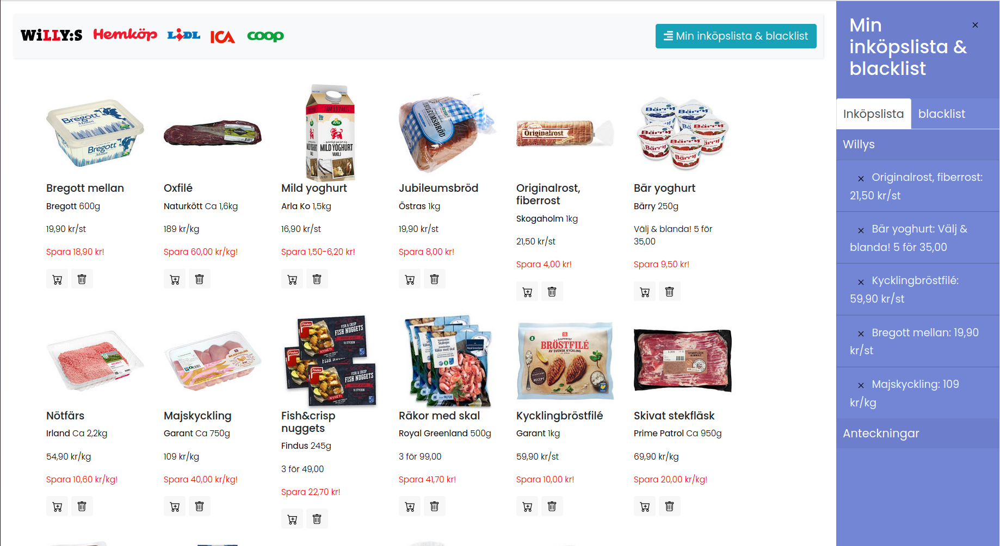

# veckansmat
Collects weekly promotion info from swedish grocery stores.

## Feature
-  Adding products to a shoppinglist (inköplista).
-  Hiding products that you don't care about.

## Get started
1. Run `python ./veckansmat/jsongenerator/main.py` to generate static json files with each store's weekly productss.
2. Open `./veckansmat/index.html` to view the website.

## Demo
[Demo](https://jueyif.github.io/veckansmat/)

## License
Licensed under the MIT license. (See LICENSE)
